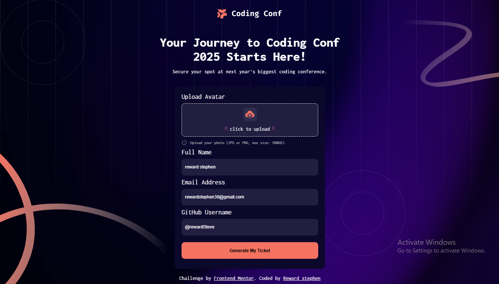
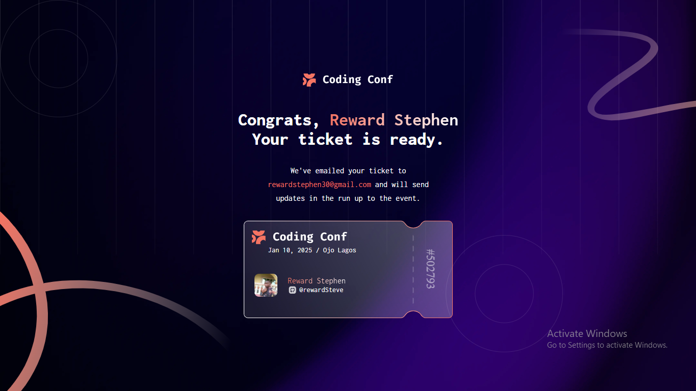

# Frontend Mentor - Conference ticket generator solution

This is a solution to the [Conference ticket generator challenge on Frontend Mentor](https://www.frontendmentor.io/challenges/conference-ticket-generator-oq5gFIU12w). Frontend Mentor challenges help you improve your coding skills by building realistic projects.

## Table of contents

- [Overview](#overview)
  - [The challenge](#the-challenge)
  - [Screenshot](#screenshot)
  - [Links](#links)
- [My process](#my-process)
  - [Built with](#built-with)
  - [What I learned](#what-i-learned)
  - [Continued development](#continued-development)
- [Author](#Reward-Stephen)

## Overview

### The challenge

Users should be able to:

- Complete the form with their details
- Receive form validation messages if:
  - Any field is missed
  - The email address is not formatted correctly
  - The avatar upload is too big or the wrong image format
- Complete the form only using their keyboard
- Have inputs, form field hints, and error messages announced on their screen reader
- See the generated conference ticket when they successfully submit the form
- View the optimal layout for the interface depending on their device's screen size
- See hover and focus states for all interactive elements on the page

### Screenshot




Add a screenshot of your solution. The easiest way to do this is to use Firefox to view your project, right-click the page and select "Take a Screenshot". You can choose either a full-height screenshot or a cropped one based on how long the page is. If it's very long, it might be best to crop it.

Alternatively, you can use a tool like [FireShot](https://getfireshot.com/) to take the screenshot. FireShot has a free option, so you don't need to purchase it.

Then crop/optimize/edit your image however you like, add it to your project, and update the file path in the image above.

**Note: Delete this note and the paragraphs above when you add your screenshot. If you prefer not to add a screenshot, feel free to remove this entire section.**

### Links

- Solution URL: [Add solution URL here](https://github.com/Reward-steve/conference-ticket-generator-main)
- Live Site URL: [Add live site URL here](https://conference-ticket-generator-gamma.vercel.app/)

## My process

### Built with

- Semantic HTML5 markup
- CSS custom properties
- Flexbox
- CSS Grid
- JavaScript

### What I learned

While working on this project, I gained valuable insights and improved my skills in several areas. Here are some of the key learnings:

```html
<h1>Some HTML code I'm proud of</h1>
```

### Responsive Design:

I enhanced my ability to create responsive layouts that adapt to different screen sizes, ensuring a good user experience on both mobile and desktop devices.

### CSS Styling:

I improved my CSS skills, including the use of custom fonts, color schemes, and hover/focus states to enhance the visual appeal and usability of the application

```css
@media (max-width: 375px) {
  form {
    width: 80%;
  }

  header img {
    width: 30%;
  }

  header h1 {
    font-size: 1.5em;
  }

  header p {
    font-size: small;
    line-height: 30px;
  }
}

input:focus,
button:focus {
  outline: 1px solid rgba(255, 255, 255, 0.801);
}

#Generate-ticket:hover {
  cursor: pointer;
  background-color: hsl(252, 6%, 83%);
}
```

### Form Validation:

I learned how to implement client-side form validation using JavaScript to ensure that users provide valid input before submitting the form. This includes checking for empty fields, validating email formats, and handling file uploads.

```js
//Email validation function
const validateEmail = (email) => {
  const regEx = /^[^\s@]+@[^\s@]+\.[^\s@]+$/;
  return regEx.test(String(email).toLowerCase());
};

const updateForm = (e) => {
  e.preventDefault();
  let Name = userName.value.trim();
  let email = userEmail.value.trim();
  let gitname = userGitHub.value.trim();
  let picture = img.src;

  //Alert Warning if any of the input field is missing
  if (Name === "" || email === "" || gitname === "") {
    alert("All fields are required.");
    return;
  }

  //Validating user input
  if (!validateEmail(email)) {
    alert("Please enter a valid email address.");
    return;
  }

  if (picture === "") {
    alert("Please upload a profile picture.");
    return;
  }

  // Further processing...
};
```

### Local Storage:

I learned how to use the browser's local storage to save and retrieve user data, allowing for a more persistent user experience.

```js
const formdetails = {
  profilePic: picture,
  userName: Name,
  userEmail: email,
  gitHub: gitname,
};

form.push(formdetails);
localStorage.setItem("item", JSON.stringify(form));
```

### Continued development

In future projects, I want to continue focusing on the following areas:

### Accessibility:

Ensuring that my projects are accessible to all users, including those with disabilities. This includes improving keyboard navigation, screen reader support, and color contrast.

### Responsive Design:

Refining my skills in creating layouts that work well on a variety of screen sizes and devices. I aim to make my designs more fluid and adaptable.

### Advanced JavaScript:

Deepening my understanding of JavaScript, including ES6+ features, asynchronous programming, and working with APIs. I also want to explore more advanced frameworks and libraries.

### Version Control:

Improving my use of Git and GitHub for version control, including

## Author

- Website - [Conference ticket generator](https://conference-ticket-generator-gamma.vercel.app/)
- Frontend Mentor - [@Reward-steve](https://www.frontendmentor.io/profile/Reward-steve)
- Facebook - [@Reward Stephen](https://web.facebook.com/reward.stephen/)
- LinkedIn - [@Reward Stephen](https://www.linkedin.com/in/reward-stephen-166021310)
